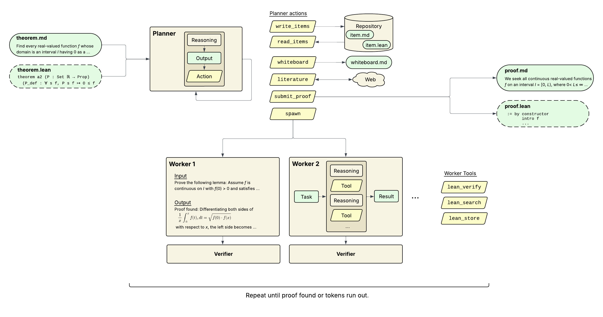

# OpenProver



Theorem prover powered by language models.

A **planner** coordinates proof search by maintaining a whiteboard and repository, delegating focused tasks to parallel **workers** via Claude CLI, OpenAI Codex CLI, or local models (vLLM).

## How it works

You give it a theorem statement (a `.md` file). A planner LLM maintains a **whiteboard** (terse mathematical scratchpad) and a **repository** of items (lemmas, observations, literature findings). Each step, the planner decides what to do: spawn workers to explore proof avenues, search literature, read/write repository items, or submit the proof.

Workers run in parallel (up to `-P` at a time), each focused on a single task. They can reference repository items via `[[wikilinks]]`. Results flow back to the planner, which updates the whiteboard and decides the next step.

With `--lean-project`, workers get access to **lean_verify** (compile Lean 4 code) and **lean_search** (search Mathlib/Lean declarations) tools, enabling interactive formal proof development.

Modes:
- **Interactive** (default): see each step's plan, accept or give feedback
- **Autonomous** (`--autonomous`): runs hands-off until proof found or budget exhausted
- **Isolation** (default) / **No-isolation** (`--no-isolation`): by default, workers have no web access. With `--no-isolation`, the planner can use `literature_search` to find relevant papers and results online
- **Formal verification** (`--lean-project`): proof attempts are verified via `lake env lean`, workers can verify code and search Lean libraries

## Requirements

- Python 3.10+
- **Claude** (default): [Claude Code](https://docs.anthropic.com/en/docs/claude-code) (`claude` command on PATH)
- **Codex** (alternative): [Codex CLI](https://developers.openai.com/codex/cli/) (`codex` command on PATH)
- **Leanstral** (alternative): Mistral's Lean-specialized model; requires `MISTRAL_API_KEY` (get one at https://console.mistral.ai/)
- **Local models** (alternative): any OpenAI-compatible server such as [vLLM](https://github.com/vllm-project/vllm); pass `--provider-url` to point at it

## Install

```bash
pip install openprover
```

Or from source:
```bash
git clone https://github.com/open-prover/openprover.git
cd openprover
python -m venv .venv && source .venv/bin/activate
pip install -e .
```

For Lean search support (optional):
```bash
openprover fetch-lean-data
```

## Usage

```bash
# Interactive mode (file argument = theorem)
openprover examples/sqrt2_irrational.md

# Autonomous with Opus, 2h time budget, 3 parallel workers
openprover --theorem examples/erdos_838.md --model opus --max-time 2h --autonomous -P 3

# Token budget instead of time
openprover --theorem examples/cauchy_schwarz.md --max-tokens 500000

# Resume an interrupted run (directory argument = run dir)
openprover runs/sqrt2-irrational-20260217-143012

# Use different models for planner and worker
openprover --theorem examples/cauchy_schwarz.md --planner-model opus --worker-model sonnet

# Enable web searches (disabled by default)
openprover --theorem examples/cauchy_schwarz.md --no-isolation

# Use a local model (via vLLM)
openprover --theorem examples/infinite_primes.md --provider local --model minimax-m2.5 --provider-url http://localhost:8000

# Use OpenAI Codex CLI (uses your Codex CLI default model)
openprover --theorem examples/infinite_primes.md --model codex

# Use OpenAI Codex CLI with an explicit model
openprover --theorem examples/infinite_primes.md --provider codex --model gpt-5.4

# Equivalent Codex shorthand
openprover --theorem examples/infinite_primes.md --model codex:gpt-5.4

# Increase reasoning effort
openprover --theorem examples/infinite_primes.md --provider codex --model gpt-5.4 --reasoning-effort xhigh
openprover --theorem examples/erdos_838.md --model opus --reasoning-effort high

# Prove and formalize in Lean 4
openprover --theorem examples/addition.md \
  --lean-project ~/mathlib4 \
  --lean-theorem examples/addition.lean

# Formalize an existing proof
openprover --theorem examples/addition.md \
  --lean-project ~/mathlib4 \
  --lean-theorem examples/addition.lean \
  --proof runs/addition-20260223/PROOF.md
```

### Subcommands

| Command | Description |
|---------|-------------|
| `openprover <theorem.md>` | Run the prover (main command) |
| `openprover inspect [run_dir]` | Browse prompts and outputs from a run |
| `openprover fetch-lean-data` | Download Lean Explore search data and models |

### Options

| Flag | Default | Description |
|------|---------|-------------|
| `--provider` | auto | Backend provider for both planner and worker |
| `--planner-provider` | | Override provider for planner |
| `--worker-provider` | | Override provider for worker |
| `--model` | auto | Model for both planner and worker (`sonnet` for Claude by default, Codex CLI default for Codex, `minimax-m2.5` for local, `leanstral` for Mistral) |
| `--planner-model` | | Override model for planner |
| `--worker-model` | | Override model for worker |
| `--reasoning-effort` | | Reasoning effort for both planner and worker |
| `--planner-reasoning-effort` | | Override reasoning effort for planner |
| `--worker-reasoning-effort` | | Override reasoning effort for worker |
| `--effort` | | Deprecated alias for `--reasoning-effort` on Claude models |
| `--max-time` | `4h` | Wall-clock time budget (e.g. `30m`, `2h`) |
| `--max-tokens` | | Output token budget (mutually exclusive with `--max-time`) |
| `--conclude-after` | `0.99` | Fraction of budget that triggers conclusion phase (0.9-1.0) |
| `--autonomous` | off | Run without human confirmation |
| `-P, --parallelism` | `1` | Max parallel workers per step |
| `--isolation` / `--no-isolation` | on | Isolation disables web access; use `--no-isolation` to enable `literature_search` |
| `--give-up-after` | `0.5` | Fraction of budget before give_up is allowed |
| `--lean-project` | | Path to Lean project with lakefile |
| `--lean-theorem` | | Path to THEOREM.lean (requires `--lean-project`) |
| `--proof` | | Path to existing PROOF.md (formalize-only mode) |
| `--lean-items` | auto | Allow saving .lean items to the repo (auto-enabled with `--lean-project`) |
| `--lean-worker-tools` | auto | Worker tool calls (lean_verify, lean_search) via MCP/native tool calling (auto-enabled with `--lean-project` + capable worker) |
| `--headless` | off | Non-interactive mode (logs to stdout, implies `--autonomous`) |
| `--verbose` | off | Show full LLM responses |
| `--read-only` | off | Inspect run without resuming |
| `--provider-url` | `http://localhost:8000` | Server URL for local OpenAI-compatible models |
| `--answer-reserve` | `4096` | Tokens reserved for answer after thinking (local models) |

Built-in model aliases:
- `sonnet`, `opus`: Claude CLI backends
- `codex`: Codex CLI backend using the local Codex CLI default model
- `leanstral`: Mistral Conversations API backend
- `minimax-m2.5`: local OpenAI-compatible/vLLM backend

For Codex-specific model names such as `gpt-5.4` or `gpt-5.2`, use `--provider codex --model <name>` or the shorthand `--model codex:<name>`.

Reasoning effort:
- Claude supports `low`, `medium`, `high`, `max`
- Codex supports `none`, `minimal`, `low`, `medium`, `high`, `xhigh`
- Mistral/Leanstral and local OpenAI-compatible models do not currently support `--reasoning-effort` in OpenProver

Codex CLI notes:
- `codex exec --json` only yields the final assistant message, so OpenProver cannot stream partial Codex text into the TUI
- Codex soft interrupt is advisory: it lets the current response finish so the final answer is preserved
- Cost is estimated from token usage for known explicit GPT-5/Codex model ids; the bare `codex` alias and unknown model names still show `$0.0000`

### TUI controls

| Key | Action |
|-----|--------|
| `r` | Toggle reasoning trace |
| `i` | Show worker input (on worker tabs) |
| `w` | Toggle whiteboard view |
| `a` | Toggle autonomous mode |
| `Left/Right` | Switch between planner/worker tabs |
| `Up/Down` | Browse step history / navigate worker actions |
| `PgUp/PgDn` | Scroll content |
| `?` | Help overlay |

When confirming a step: Tab switches between accept/feedback, Enter confirms or opens detail view, Esc dismisses, `a` accepts and enters autonomous mode.

## Planner actions

Each step, the planner chooses one action:

| Action | Description |
|--------|-------------|
| `spawn` | Delegate tasks to parallel workers |
| `literature_search` | Web-enabled search for relevant papers/results |
| `read_items` | Retrieve full content of repository items |
| `write_items` | Create, update, or delete repository items (lean items auto-verified) |
| `write_whiteboard` | Update the whiteboard without spawning workers |
| `read_theorem` | Re-read theorem statement(s) and any provided proof |
| `submit_proof` | Submit proof (informal and/or formal Lean) |
| `give_up` | Abandon search (only allowed after give-up threshold) |

## Worker tools

When `--lean-project` is set with a tool-capable worker model, workers get access to:

| Tool | Description |
|------|-------------|
| `lean_verify(code)` | Compile Lean 4 code via `lake env lean`, returns OK or compiler errors |
| `lean_search(query)` | Search Mathlib/Lean declarations by natural language query |

Tools are provided via MCP (Claude or Codex workers) or native tool calling (vLLM or Mistral workers). Actions are shown in the worker tab and can be browsed with arrow keys.

## Output

Each run creates a directory under `runs/`:

```
runs/<slug>-<timestamp>/
  THEOREM.md           - original theorem statement
  THEOREM.lean         - formal Lean statement (if provided)
  WHITEBOARD.md        - current whiteboard state
  PROOF.md             - final proof (if found)
  PROOF.lean           - formal Lean proof (if lean mode)
  DISCUSSION.md        - post-session analysis
  repo/                - repository items (lemmas, observations, etc.)
  steps/step_NNN/      - per-step planner decisions and worker results
  archive/calls/       - raw LLM call logs with cost/timing
```

All state lives on disk, so runs can be interrupted and resumed.

## Example theorems

The `examples/` directory has theorem statements at various difficulty levels:

| File | Difficulty |
|------|-----------|
| `sqrt2_irrational.md` | Easy |
| `infinite_primes.md` | Easy |
| `e_irrational.md` | Medium |
| `cauchy_schwarz.md` | Medium |
| `erdos_205.md` | Medium |
| `erdos_838.md` | Hard (open) |
| `collatz.md` | Harder (open) |

# Ideas

- Add modes where OpenProver also tries to 1) simplify a proof or make it nicer and 2) generalize a proof.
- In the `lean_verify` action, provide proof states to the planner.

# Cite

If you find OpenProver helpful in your research cite simply as:

```
@misc{openprover,
  author = {Matěj Kripner},
  title = {OpenProver},
  year = {2025},
  publisher = {GitHub},
  url = {https://github.com/kripner/openprover}
}
```
