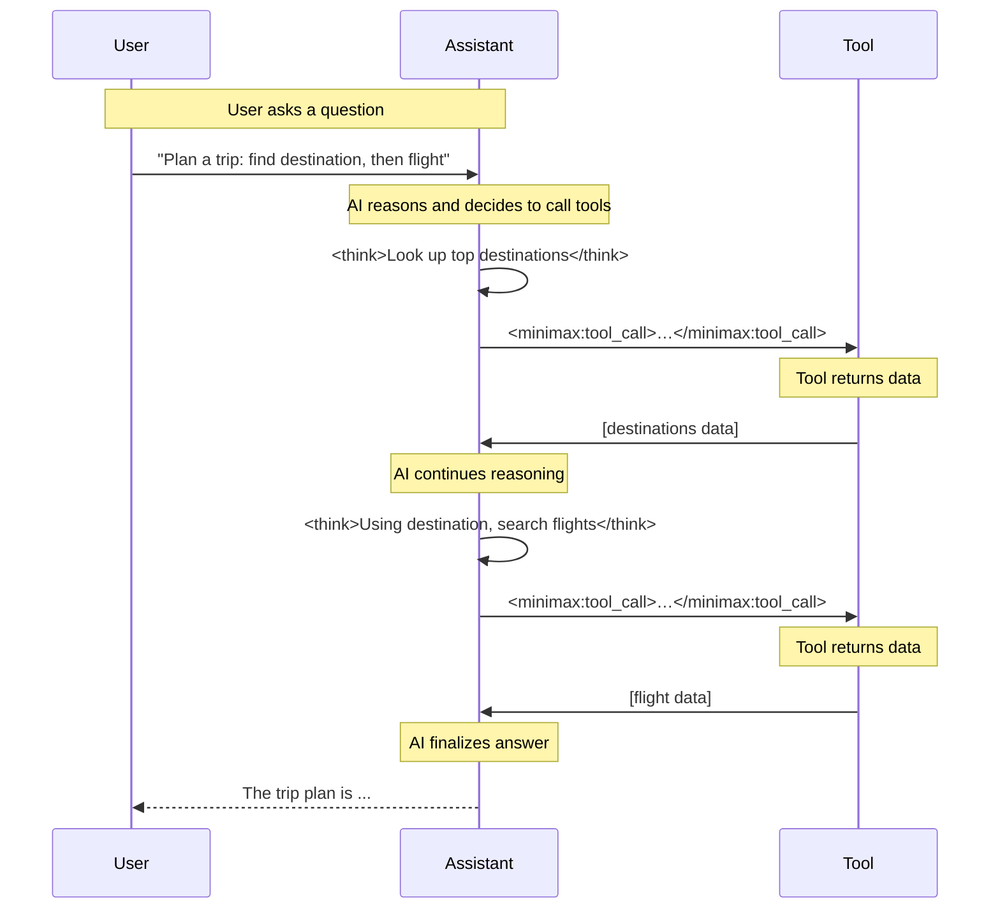

# Executive Summary

This report details **vLLM 16.0.0**’s handling of chained reasoning and tool calls—especially for the **MiniMax/MiniMax-M2.5** models.  We explain how vLLM breaks an LLM’s output into *streaming deltas*, distinguishing “reasoning” vs “content,” and how assistant turns start/stop (including the special `</think>` tag) are handled.  We describe vLLM’s tool-calling mechanism: how an assistant message ends with a `tool_calls` finish reason, how the client sends tool results, and how the model resumes and finishes.  We compare two MiniMax reasoning parsers (`minimax_m2` vs `minimax_m2_append_think`), including their prompt templates, regex logic, and known bugs (e.g. missing `<think>` after a tool call【40†L518-L527】).  Examples show a multi-step loop (Reason → ToolCall → ToolResult → further Reason → ToolCall → result → final answer).  We also cover how to **limit reasoning length** (using prompt rules, stop sequences, `max_tokens`, and client-side streaming interrupts) and how to **cap the number of tool calls** (via orchestration logic and prompts).  We detail streaming vs. non-streaming behavior (e.g. how vLLM streams deltas with separate `delta.reasoning` and `delta.content` fields【45†L2139-L2145】【48†L2358-L2364】).  Concrete flag/config examples for vLLM 16.0.0 (e.g. `--reasoning-parser minimax_m2_append_think`, `--tool-call-parser minimax_m2`, `--enable-auto-tool-choice`, `stop=["</think>"]`, `max_tokens`) and code snippets (JSON request/response, Python) are provided.  A comparison table contrasts the two MiniMax parsers (features, outputs, usage).  Finally, a mermaid timeline illustrates the multi-turn tool loop. All details cite vLLM docs, GitHub code or issues, and MiniMax guides where possible.

## vLLM Streaming I/O and “Reasoning” Outputs

**Streaming Deltas:**  In vLLM’s API (OpenAI-compatible ChatCompletion endpoint), generation is returned in *chunks* (deltas). Each chunk `choices[0].delta` may include `content` (final answer text), `reasoning` (intermediate “thought” text), and/or `tool_calls` entries, as well as a `finish_reason`.  For models with reasoning enabled, vLLM splits the assistant’s output: tokens before a reasoning-end tag go into `delta.reasoning`, tokens after go into `delta.content`【45†L2142-L2148】【48†L2358-L2364】.  For example, a streaming chunk might have only `reasoning="…"` (if still in the thinking phase) or only `content="…"` (if final answer or post-</think> content).  

- If **no reasoning parser** is set, all text appears in `delta.content` (no separate `delta.reasoning`). 
- If a **reasoning parser** is active (e.g. for MiniMax-M2), the logic in `extract_reasoning_streaming()` decides how to split text.  For MiniMax-M2: everything up to an `</think>` tag is reasoning; once the end tag appears, earlier text is returned as reasoning and the rest as content【48†L2358-L2364】.  After the end tag has appeared, further deltas have `content` only【48†L2352-L2360】.  

Each assistant turn in vLLM is bounded by `finish_reason`. When the model **stops normally**, `finish_reason` = `"stop"`. When it outputs a tool call and halts for the application to run the tool, vLLM sets `finish_reason` = `"tool_calls"`【47†L223-L227】.  In streaming, the final chunk of a tool-calling assistant message will carry `finish_reason: "tool_calls"`, and `choices[0].message.tool_calls` will list the function to invoke (with `id`, function `name`, and `arguments`).  The client then sends back the tool’s result as a message of role `"tool"` with the same `tool_call_id`.

**Example (JSON):** A simplified multi-step exchange (abridged):
```jsonc
// Request: ask a question
{
  "model": "MiniMax/MiniMax-M2.5",
  "messages": [{"role":"user","content":"What is 2+2?"}],
  "tools": [{"name":"compute","description":"Add numbers","parameters":{"type":"object","properties":{"a":{"type":"integer"},"b":{"type":"integer"}},"required":["a","b"]}}],
  "tool_choice": "auto"
}
// Response (assistant, with reasoning and tool call)
{
  "choices": [{
    "message": {
      "role": "assistant",
      "content": "<think>To compute 2+2, I will use the calculator tool.</think>\n",
      "tool_calls": [{
        "id": "call_abc123",
        "type": "function",
        "function": {
          "name": "compute",
          "arguments": "{\"a\": 2, \"b\": 2}"
        }
      }]
    },
    "finish_reason": "tool_calls"
  }]
}
// Request: tool result back to model
{
  "model": "MiniMax/MiniMax-M2.5",
  "messages": [
    {"role":"user","content":"What is 2+2?"},
    {"role":"assistant","content":"<think>To compute 2+2, I will use the calculator tool.</think>\n","tool_calls":[{"id":"call_abc123","type":"function","function":{"name":"compute","arguments":"{\"a\":2,\"b\":2}"}}]},
    {"role":"tool","tool_call_id":"call_abc123","content":"4","name":"compute"}
  ],
  "tools": [{"name":"compute","description":"Add numbers","parameters":{/*same schema*/}}],
  "tool_choice": "auto"
}
// Response: assistant continues and finishes
{
  "choices": [{
    "message": {
      "role": "assistant",
      "content": "The result is 4.",
      "reasoning": "The calculator returned 4, so the answer is 4."
    },
    "finish_reason": "stop"
  }]
}
```
This shows: **Assistant→ToolCall** (finish_reason=`tool_calls`) then **Tool→Assistant** with final answer (finish_reason=`stop`), with content and a separate reasoning field.  In real streaming, the reasoning text would have appeared chunk by chunk in `delta.reasoning` and the final content in `delta.content`. 

## Assistant Message Boundaries and Special Tokens

MiniMax’s chat template uses special markers for message roles.  For example, the MiniMax-M2.5 template (Jinja) demarcates system, user, and assistant turns with tokens like `]~b]user` and `]~b]ai`【52†L359-L367】.  Concretely:
- System prompt begins with `]~!b[]~b]system` and ends with `[e~[`.
- Each user message is prefixed by `]~b]user` and terminated by `[e~[`.
- The assistant’s *generation prompt* begins with `]~b]ai` followed by `<think>`.  All output before `</think>` is reasoning.  The final assistant message ends with a closing marker.

These markers ensure vLLM knows where one message ends and the next begins.  In practice, the client sees them only as delimiting text. For example, an assistant response might appear as: 
```
"]~b]ai <think>The reasoning text...</think>Here is the answer."
```
Internally, `]~b]ai` signals “start of assistant reply,” and `</think>` marks end of reasoning【48†L2344-L2352】【52†L359-L363】. 

## Reasoning vs. Content Chunks

When reasoning is enabled, vLLM splits the assistant’s generation into two logical parts: the **reasoning** (inner thoughts) and the final **content** (answer)【45†L2139-L2145】.  In streaming mode:
- **Delta.reasoning** is filled with tokens until the `</think>` tag.  
- Once `</think>` appears in a delta, that chunk is split: text before the tag goes into `reasoning`, after the tag goes into `content`【48†L2358-L2364】.  
- After the end token, all further tokens are returned as `delta.content` (no more reasoning)【48†L2352-L2360】.  
- If no reasoning parser is used, `delta.content` carries all text. 

For example, with a reasoning parser, you might see stream chunks like:
```
delta.role = "assistant", delta.reasoning = "First part of reasoning...", finish_reason=null
delta.role = "assistant", delta.reasoning = "continuing reasoning...", finish_reason=null
delta.role = "assistant", delta.reasoning = "last thought", delta.content = "Answer text begins", finish_reason=null
delta.role = "assistant", delta.content = "full answer continues", finish_reason="stop"
```
Here the third chunk contained the `</think>` split. In non-streaming (final response), the final answer object will have `message.reasoning` and `message.content` as separate fields【45†L2139-L2145】.  Tool calls always appear in the assistant’s content field; **vLLM does not parse functions from the reasoning text**【45†L2230-L2232】. 

## MiniMax M2.5 Reasoning Parsers

vLLM provides two MiniMax-specific reasoning parsers: **`minimax_m2`** and **`minimax_m2_append_think`**. They differ in how they treat the `<think>` tokens and split content.

- **`minimax_m2` (BaseThinkingReasoningParser)**: Assumes the model will output a closing `</think>` token but never a starting `<think>` (since the prompt already inserted one).  Thus **all tokens up to the end tag are “reasoning,” and tokens after are content**【48†L2344-L2352】【48†L2358-L2364】.  In streaming, it works like this:
  - If `</think>` has *not yet appeared*, every delta is returned as `reasoning`.
  - When a delta includes the `</think>` token, the parser splits it: text before `</think>` -> `reasoning`, text after -> `content`【48†L2358-L2364】.
  - After that, any further text is `content`【48†L2352-L2360】. 
  - This parser does **not** prepend anything; it expects the system (or the first assistant chunk) to have produced `<think>…</think>`. 

- **`minimax_m2_append_think`**: This hacky parser prepends `<think>` to the output **because some configurations (e.g. basic chat mode) might never generate the start tag**.  Its logic is:
  - On the first streaming chunk (`len(previous_token_ids)==0`), it inserts `"<think>"` before the text, then returns that as content【49†L2122-L2124】.
  - It never returns anything in `delta.reasoning` (always uses `content` field).
  - At the end of generation, it outputs the full model output prefixed by `<think>` as `content`【49†L2126-L2130】.
  - In effect, it forces the `<think>…</think>` wrapper around everything. 

The key differences are summarized here:

| Feature              | `minimax_m2`                                     | `minimax_m2_append_think`                           |
|----------------------|--------------------------------------------------|----------------------------------------------------|
| **Prompt Template**  | Expects prompt to include `<think>` (as in MiniMax chat template)【52†L371-L376】. | Works even if prompt did **not** include `<think>`. |
| **Streaming Behavior** | Emits reasoning until `</think>` tag appears, then switches to content (see code)【48†L2358-L2364】.  After the tag, all text is content. | On first chunk, injects `<think>` and emits it as content. No separate reasoning field. |
| **Final Parsing**      | Splits final output at `</think>`: everything before is reasoning, after is content. | Prepends `<think>` to final output and treats all output as content. |
| **Tool Calls Parsing**| Same for both: tool calls are always parsed from the “content” side. (Reasoning text is ignored for tools【45†L2230-L2232】.) | Same as `minimax_m2`. |
| **Usage Note**        | Intended when `<think>` is already in the model’s output or template (e.g. non-streaming “responses” API)【26†L32-L34】. | Often used for streaming/vLLM serve so that `<think>` is present; recommended in vLLM recipes for MiniMax-M2.5 streaming【26†L32-L34】. |
| **Known Issues**      | *Bug:* If a tool call occurs, MiniMax-M2 may resume reasoning without re-outputting `<think>` (i.e. missing it), causing parsing errors【40†L514-L522】.  | Generally similar to above (missing `<think>` applies to both after first call).  No distinct bugs beyond those of M2 parser. |

**References:** The above logic comes from vLLM’s source for these parsers.  For `minimax_m2`, the streaming extractor is implemented in `vllm/reasoning/minimax_m2_reasoning_parser.py`, as documented【48†L2358-L2364】.  For `minimax_m2_append_think`, the code in that same file shows the insertion of `<think>`【49†L2122-L2130】.

## Tool-Calling Flow and Parsing

When the model outputs a tool invocation, vLLM captures it in the `assistant` message’s `tool_calls` field. In MiniMax’s format, tool calls are represented as XML inside the assistant’s content (e.g. `<minimax:tool_call>…</minimax:tool_call>`). vLLM provides a **`minimax_m2` tool parser** to extract these calls. Internally, it looks for the `<minimax:tool_call>…</minimax:tool_call>` block using regex, then parses each `<invoke name=...>…</invoke>` inside.  For example, from vLLM’s code (paraphrased):

```python
self.tool_call_complete_regex = re.compile(r"<minimax:tool_call>(.*?)</minimax:tool_call>", re.DOTALL)
self.invoke_complete_regex = re.compile(r"<invoke name=(.*?)</invoke>", re.DOTALL)
self.parameter_complete_regex = re.compile(r"<parameter name=(.*?)</parameter>", re.DOTALL)
```
(VLLM’s implementation sets up these patterns【59†L2850-L2858】, which match the MiniMax tool-call XML.)  On a full message, it finds each `<invoke name="func">...</invoke>` segment, extracts the function name and parameters, and converts them to JSON.  In code, each `<invoke>` is processed: 
```python
name_match = re.search(r"^([^>]+)", invoke_str)
function_name = self._extract_name(name_match.group(1))
for match in self.parameter_complete_regex.findall(invoke_str):
    param_match = re.search(r"^([^>]+)>(.*)", match, re.DOTALL)
    param_name = self._extract_name(param_match.group(1))
    param_value = param_match.group(2).strip()
    # Determine param_type from schema, then convert:
    param_dict[param_name] = self._convert_param_value_with_types(param_value, param_types)
tool_call = {"type":"function",
             "function": {"name": function_name, 
                          "arguments": json.dumps(param_dict)}}
```
This mirrors the official MiniMax guidance【22†L421-L430】【22†L431-L438】.  The end result is a structured tool call (OpenAI-style `FunctionCall`).

**Tool Calls and Reasoning:**  vLLM only **parses tools from the `content` portion**, not from reasoning. Thus any `<invoke>` inside a `<think>` block would not be recognized【45†L2230-L2232】.  In MiniMax usage, tool calls should not appear in the reasoning anyway.

**Emission Timing:** During streaming, when the model generates a tool call, vLLM emits a `finish_reason = "tool_calls"` with the tool call in that assistant chunk. Streaming ends for that turn. The client then runs the tool, sends back the result, and the conversation resumes.  As seen in [40], the prompt template may look like this to the user:
```
Assistant: <think>Reasoning…</think>       (finish: tool_calls)
Tool: [tool result]
Assistant: continued reasoning + final answer (finish: stop)
```
One must be careful: after returning from a tool, the model sometimes *should* re-open a new `<think>` block, but due to a vLLM bug it might not【40†L518-L527】, causing the reasoning to be unwrapped. The workaround is to use the append-think parser or manually insert a new `<think>` in the prompt.

## MiniMax Parser Bugs

Two notable issues have been reported:

- **Missing `<think>` after tool calls:**  As documented in [Bug #35349](https://github.com/vllm-project/vllm/issues/35349), if an assistant message ended in `tool_calls` and you feed back the tool result, the model’s next output sometimes lacks the `<think>` start tag. This breaks the reasoning parser logic (which expects a fresh `<think>`).  The reported fix is to treat the reasoning after a tool call as if it were wrapped in `<think>` again【40†L518-L527】.  Until fixed, using `minimax_m2_append_think` helps, since it always (re)inserts `<think>`【49†L2122-L2128】.
- **Parameter type conversion bug:**  An issue has been noted (see GitHub issue 28963) that in the minimax tool parser, an `Optional` parameter type may be misinterpreted if represented as a list. The code does `param_type.lower()` on a value that can be a list, raising an error【54†L55-L64】. This is a parser bug to be aware of, but updating to vLLM 16.0.0 (or later) should include fixes.

## Cap Reasoning Tokens (“token budget”)

To prevent the model from spending too many tokens on reasoning, you can:

1. **Prompt Engineering:** Instruct the model explicitly to reason briefly, e.g. “You have at most N tokens to think. Provide a concise plan.”   You can also limit output by adding a stop sequence. For instance, using `stop=["</think>"]` in the API call will make vLLM stop generation when the model emits `</think>`【45†L2230-L2233】.  (This ensures the assistant closes its reasoning block and yields control.)

2. **`max_tokens` / `max_completion_tokens`:**  Set a hard limit on tokens. In vLLM’s OpenAI-compliant API, the `max_tokens` (or `max_completion_tokens`) parameter caps the total output tokens for each request【73†L3156-L3160】.  For example, in Python:
   ```python
   resp = client.chat.completions.create(
       model="MiniMax/MiniMax-M2.5",
       messages=[{"role":"user","content":"Your query"}],
       max_tokens=150  # limit all generated tokens (reasoning+answer)
   )
   ```
   Or when launching the vLLM server: `--override-generation-config '{"max_new_tokens":150}'` to apply a server-wide limit【76†L2294-L2300】.

3. **Stop Sequences:**  Use an explicit stop sequence like `"</think>"`.  In the API request:
   ```json
   {"stop": ["</think>"]}
   ```
   This ensures the model stops once it finishes reasoning. vLLM supports `stop` in chat completions【45†L2230-L2233】.

4. **Streaming interruption:** If streaming, you can count tokens as they arrive (e.g. count characters or chunks in `delta.reasoning`) and break the loop when a threshold is reached, then treat that as “done.” Unfortunately, vLLM doesn’t have a built-in “cancel” API, but you can stop processing further chunks on the client side and issue a new request if needed. E.g.:
   ```python
   count = 0
   for chunk in resp:
       if hasattr(chunk.choices[0].delta, "reasoning"):
           count += len(chunk.choices[0].delta.reasoning.split())
           if count > 100: 
               break  # reached token cap
   ```
   The partial chunks can then be used as you see fit. One can also append a dummy stop token or close tag and finish.

5. **Token-budget-aware sampling / `max_new_tokens` per phase:** Break the conversation into phases. For example, first request for *only reasoning* with a smaller `max_tokens`, then a second request for the answer. vLLM allows setting `max_tokens` per call, so you can e.g. first call with `max_tokens=50` to get reasoning (and maybe a tool call), then after tools return, call again with `max_tokens=50` for the final answer.

No model-internal “reasoning only” cap exists, so you must handle this at the prompt/API level. Using a combination of the above (stop sequence + `max_tokens`) is the most reliable. For instance:

```bash
# Start vLLM server with a hard max tokens:
python3 -m vllm.entrypoints.openai.api_server \
  --model MiniMax/MiniMax-M2.5 \
  --trust-remote-code \
  --tool-call-parser minimax_m2 \
  --reasoning-parser minimax_m2_append_think \
  --override-generation-config '{"max_new_tokens":100}' ...
```
This enforces at most 100 tokens output per request.  Then in each request you might still use `stop=["</think>"]` to force termination of reasoning if 100 is hit.

## Limiting the Number of Tool Calls

vLLM itself does not offer a direct “max_tool_calls” parameter. To restrict calls to N:

- **Prompt constraint:** You can include in the user or system prompt an instruction, e.g. “You may call at most 2 tools for this query.” This is a soft constraint the model may follow.
- **Orchestration logic:** Count the tool calls your application receives. After the Nth call, ignore or reject further calls. For example, in your agent code:
   ```python
   calls = []
   for chunk in stream:
       if chunk.choices[0].delta.tool_calls:
           calls.append(chunk.choices[0].delta.tool_calls[0])
           if len(calls) >= N:
               break
   ```
   or check the `tool_call_id` count in the JSON. Once N calls are made, you can for instance set `tool_choice="none"` on further requests to disable auto-calling.

- **Named/Required Calls:** If you know exactly which tools to call, use `tool_choice={"type":"function", "function": {"name": ...}}` to force that function (and only one) at a time. This sidesteps auto calls altogether.  Or use `tool_choice="required"` which will force at least one call, but you can then break after processing N. 

- **Tool schema hints:** In your function definitions, you could include constraints or short descriptions that discourage multiple calls. For example, use schema descriptions indicating only one call is needed.

- **Server flags:** There is no vLLM flag for max calls. Instead, you can programmatically abort generation after N calls as above. 

**Example:** Suppose we only want at most 2 tool calls. We can do:
```python
resp = client.chat.completions.create(..., tool_choice="auto", stream=True)
tool_calls = []
for chunk in resp:
    if chunk.choices[0].delta.tool_calls:
        tool_calls.append(chunk.choices[0].delta.tool_calls[0])
        if len(tool_calls) >= 2:
            break  # stop reading further; we've reached the limit
```
Then handle those two, and finally send a new request with any needed remaining context. This limits tool calls by stopping further generation.

## Streaming vs. Non-Streaming

- **Non-Streaming (batch)**: vLLM returns the full assistant message in one JSON. The `choices[0].message` will contain possibly both `reasoning` and `content` fields (if reasoning parser is used)【45†L2139-L2145】. The `finish_reason` is given (usually `"stop"` or `"tool_calls"`). All tool calls (if any) are in `message.tool_calls`.  The client sees the final answer and the reasoning separately.  

- **Streaming**: The client receives many small chunks. Each chunk has a `delta` object. In streaming mode, one may see many `delta.reasoning` chunks, then eventually a `delta.content` chunk. Tool calls appear as soon as generated; the stream stops for `"tool_calls"` and the client must supply the tool result before continuing.  In MiniMax’s case, the tool call content comes in the assistant’s last chunk (with `finish_reason:"tool_calls"`), and then streaming halts until the tool returns.

To **detect a full tool_call in stream**, check if `delta.tool_calls` is non-empty. That indicates a call. One must then pause consuming from `stream` and issue the tool. When resuming, the client typically restarts the stream with the tool result message included in `messages`.  

To **interrupt streaming** (e.g. to enforce a token cap), the client can simply stop iterating. vLLM will eventually time out or cancel the generation if not consumed, but typically you’d just break the loop and close the stream.

If you break mid-assistant message (e.g. cutting off reasoning), you might send the partial message back to vLLM as context to resume. For example, if you stopped after 50 tokens of reasoning (not yet done), you could append those tokens to `messages` (role=`assistant`) and then call again. This yields “partial reasoning”. There is no automatic partial-return mode, so it’s on the client to handle continuity.

## Configuration Snippets

**vLLM Server Flags (16.0.0):**
- Enable auto tool-calling:  
  ```
  --enable-auto-tool-choice 
  --tool-call-parser minimax_m2 
  --reasoning-parser minimax_m2_append_think
  --trust-remote-code
  ```
- Cap tokens globally:  
  ```
  --override-generation-config '{"max_new_tokens":1000}'
  ```
- Chat template (if custom):  
  ```
  --chat-template path/to/chat_template.jinja
  ```
- If using named or none calls:  
  ```
  --exclude-tools-when-tool-choice-none
  ```

**ChatCompletion Request (Python):**
```python
client = OpenAI(base_url="http://localhost:8000/v1", api_key="XYZ")
resp = client.chat.completions.create(
    model="MiniMax/MiniMax-M2.5",
    messages=[
        {"role": "system", "content": "You are an assistant."},
        {"role": "user",   "content": "Compute 2+2."}
    ],
    tools=[{"name":"compute","description":"Add numbers","parameters":{/*schema*/}}],
    tool_choice="auto",
    max_tokens=50,
    stop=["</think>"],
)
```
Here `max_tokens=50` limits total output, and `stop=["</think>"]` ends reasoning.  

**Tool Parse Template (from MiniMax guide):**
The official chat template shows how to format tool calls (in XML):
```
<minimax:tool_call>
  <invoke name="function_name">
    <parameter name="param1">value1</parameter>
    ...
  </invoke>
</minimax:tool_call>
```
vLLM’s `minimax_m2_tool_parser` uses regex on these tags【59†L2850-L2858】【58†L1-L4】.

## Example Multi-Step Sequence (Mermaid)



This timeline shows *User→Assistant (reason)*, *Assistant→ToolCall1*, *Tool1→Assistant*, *Assistant→ToolCall2*, *Tool2→Assistant*, then *Assistant→User (answer)*.

## Summary

In sum, **vLLM splits assistant output into reasoning and content via customizable parsers**, emitting reasoning tokens in `delta.reasoning` until a `</think>` tag, then content tokens in `delta.content`.  Tool calls end an assistant turn (finish_reason=`tool_calls`), the tool returns a message, and then a new assistant turn resumes.  MiniMax’s parsers (`minimax_m2` vs `minimax_m2_append_think`) differ in whether they expect `<think>` in the output or insert it themselves【48†L2358-L2364】【49†L2122-L2129】. To prevent runaway reasoning, use stop sequences and `max_tokens`.  To limit tool calls, enforce limits in your agent logic or prompt.  All behaviors above are consistent with the [vLLM docs] and [MiniMax guides]【45†L2139-L2145】【22†L421-L430】.

**Sources:** Official vLLM documentation and code (vLLM 16.0.0)【45†L2139-L2145】【48†L2358-L2364】【59†L2850-L2858】, MiniMax-M2.5 docs/recipes【22†L421-L430】【26†L32-L34】, and relevant GitHub issues【40†L518-L527】【54†L55-L64】.